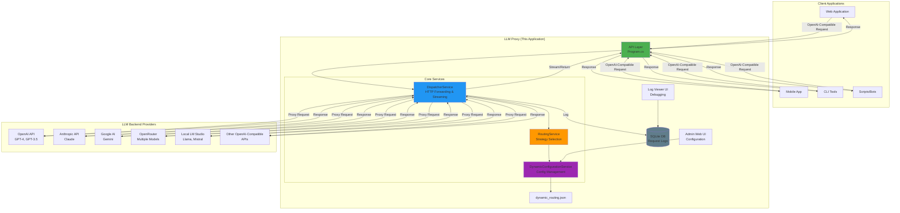
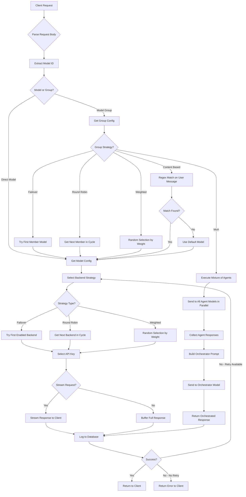
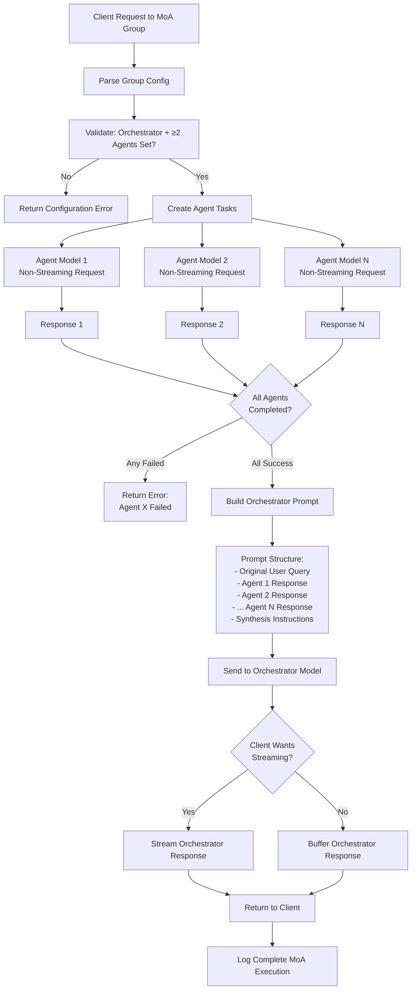
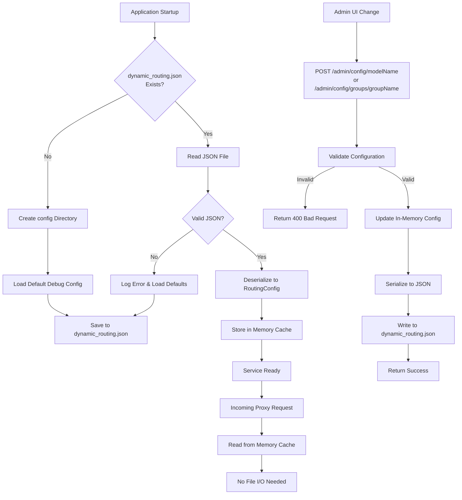
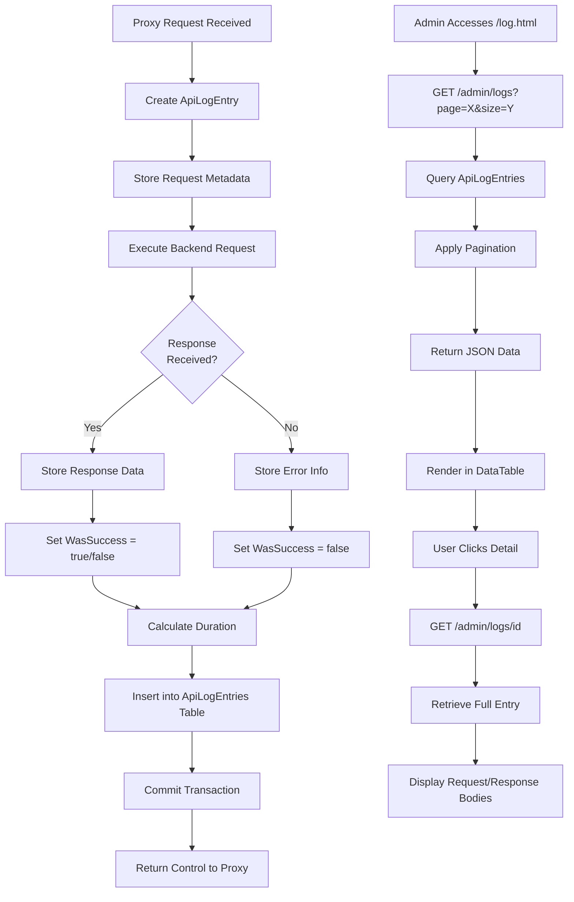
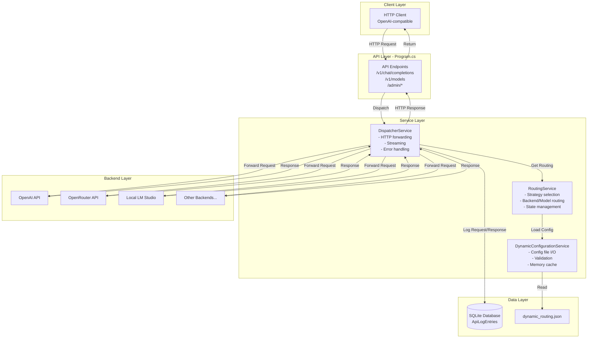
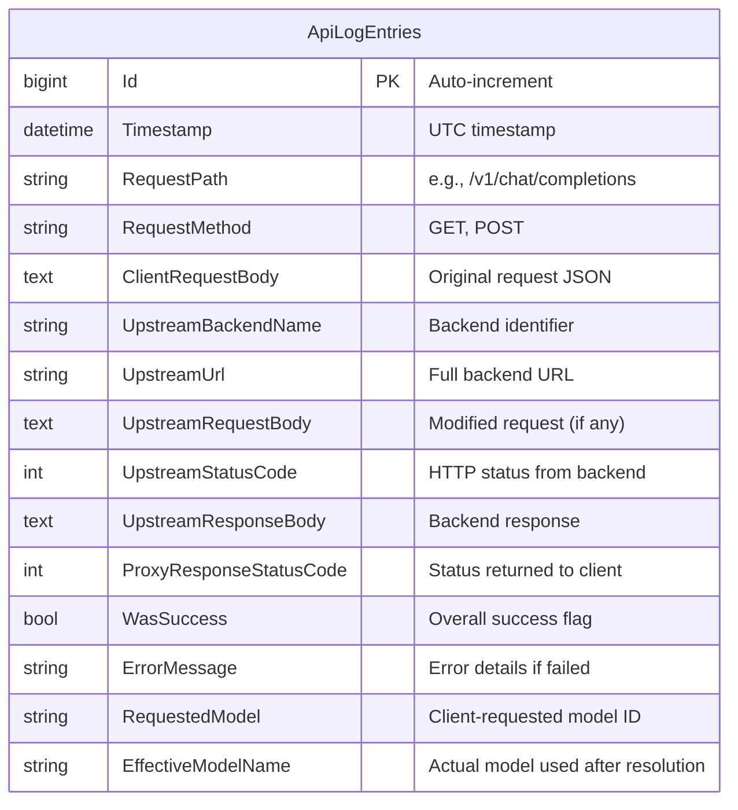

<p align="center">
  
</p>

# LLM API Proxy and Routing Manager

[](https://opensource.org/licenses/MIT)
[](https://dotnet.microsoft.com/download/dotnet/9.0)
[](https://learn.microsoft.com/en-us/dotnet/csharp/)
[](https://www.sqlite.org/)

The LLM API Proxy and Manager is a C#-based ASP.NET Core 9 application designed to serve as an intelligent and resilient intermediary between LLM API clients (e.g., frontend apps, other services) and various OpenAI-compatible backend providers. It centralizes request routing, API key management, error handling, and offers advanced strategies like Model Groups and Mixture of Agents, abstracting backend complexities and ensuring a seamless, uninterrupted, and versatile experience.

## 📚 Table of Contents

- [Purpose](#-purpose)
- [Key Features](#-key-features)
- [Technical Stack](#️-technical-stack)
- [Project Structure](#-project-structure)
- [Architecture & Flow Diagrams](#-architecture--flow-diagrams)
- [Developer Guide](#-developer-guide)
- [Getting Started](#️-getting-started)
- [API Endpoints](#-api-endpoints)
- [Configuration Details](#-configuration-details-dynamic_routingjson)
- [Usage Examples](#-usage-examples)
- [Troubleshooting](#-troubleshooting)
- [Potential Future Enhancements](#-potential-future-enhancements)
- [Deployment](#-deployment)
- [Use Cases](#-use-cases)
- [License](#-license)
- [Acknowledgements](#-acknowledgements)

## ⭐ Quick Highlights

```bash
# Install and run in under 5 minutes
git clone https://github.com/obirler/LLMProxy.git
cd LLMProxy
dotnet restore && dotnet build
dotnet ef database update
dotnet run

# Access admin interface
open http://localhost:7548/admin
```

**What makes LLMProxy special?**
- 🎯 **Zero Code Changes**: Switch between GPT-4, Claude, Gemini, or local models without touching your app
- 🛡️ **Bulletproof Resilience**: Automatic failover, multiple API keys, and intelligent error handling
- 🤖 **Mixture of Agents**: Combine responses from multiple AI models for superior results
- 📊 **Smart Routing**: Content-based routing, weighted distribution, and round-robin strategies
- 🔍 **Full Observability**: Every request logged to SQLite for debugging and analytics
- ⚡ **Streaming Support**: Low-latency proxy for real-time token streaming
- 🎨 **Web-Based Admin**: Configure everything through an intuitive UI - no config file editing

## 🚀 Purpose

*   **Aggregate Multiple LLM Backends:** Consolidate access to various OpenAI-compatible APIs (e.g., OpenAI, OpenRouter, Google Gemini, Mistral, DeepSeek, local LM Studio instances).
*   **Dynamic Request Routing:** Intelligently route incoming requests to one or more configured backend providers based on defined strategies for individual models or groups of models.
*   **Advanced Model Orchestration:**
    *   **Model Groups:** Define logical groups of models that can be targeted as a single entity, with their own routing strategies.
    *   **Mixture of Agents (MoA):** Send a user request to multiple "agent" models simultaneously, then use an "orchestrator" model to synthesize a final answer from their collective responses.
*   **Load Balancing & Failover:** Distribute load across multiple API keys for a single backend or across different backends/models within a group. Automatically failover to backup options in case of errors.
*   **Robust Streaming Support:** Full, low-latency pass-through support for `stream=true` (text/event-stream) responses, including for the final output of MoA orchestrators.
*   **Error Abstraction & Resilience:** Suppress transient backend errors (like rate limits or temporary server issues) from reaching the client. Only fails if all configured options for a request are unavailable. Detects application-level errors within successful (200 OK) responses to trigger retries.
*   **Centralized Configuration:** Manage models, model groups, backend providers, API keys, and routing strategies through a simple web-based admin interface.
*   **Observability:** Provides detailed API request/response logging to a local SQLite database for debugging, monitoring, and auditing.

## ✨ Key Features

*   **Model & Model Group Management:**
    *   Define individual **Models** with their own set of backends and routing strategies.
    *   Create **Model Groups** that act as a single endpoint but can contain multiple underlying models.
*   **Supported Routing Strategies:**
    *   **For Models (Backend Selection):**
        *   **Failover:** Prioritize backends/keys in a specific order.
        *   **Round Robin:** Cycle through available backends/keys sequentially.
        *   **Weighted Distribution:** Route traffic to backends according to configured weights.
    *   **For Model Groups (Member Model Selection):**
        *   **Failover:** Prioritize member models in a specific order.
        *   **RoundRobin:** Cycle through available member models sequentially.
        *   **Weighted (Members):** Distribute requests among member models based on assigned weights (currently simplified as random selection if weights are equal).
        *   **Content Based:** Route to a specific member model within the group based on regex matching against the last user message.
        *   **Mixture of Agents (MoA):**
            *   Sends the client's request to multiple configured "agent" models in parallel (non-streaming).
            *   Collects responses from all agents.
            *   Constructs a new prompt (including the original query and all agent responses) and sends it to a designated "orchestrator" model.
            *   The orchestrator's response is then returned to the client (streaming if requested).
*   **Provider Multiplexing:** Seamlessly combine and switch between different LLM providers for models or within groups.
*   **Backend-Specific Model Names:** Map a general model/group name requested by the client to a specific model name required by a particular backend.
*   **Streaming Proxy:** Efficiently proxies `text/event-stream` responses. Failover for streaming requests happens before the first token. For MoA, agent calls are non-streaming, but the final orchestrator response can be streamed.
*   **Intelligent Error Handling:**
    *   Hides transient backend failures from the client.
    *   Detects application-level errors (e.g., context length exceeded) even in 200 OK responses and triggers failover/retry logic for the *next* request to that backend. The current client still receives the error content.
*   **Dynamic Configuration:**
    *   Manage all configurations via a web UI (`/admin`).
    *   Configuration is persisted in `config/dynamic_routing.json`.
    *   Default configurations are loaded on first run.
*   **Standard OpenAI-Compatible Endpoints:**
    *   `POST /v1/chat/completions`
    *   `POST /v1/completions` (Legacy)
    *   `POST /v1/embeddings`
    *   `GET /v1/models` (Lists all configured models and model groups)
*   **Database Logging:**
    *   Detailed logging of requests, backend attempts, responses, and errors to a local SQLite database.
    *   View logs via a paginated and searchable web UI (`/log.html`).
*   **Health Check:** `GET /health` endpoint.

## 🛠️ Technical Stack

*   **Language:** C# 12
*   **Framework:** .NET 9 (ASP.NET Core Minimal API)
*   **Database:** SQLite (with Entity Framework Core) for logging.
*   **Frontend (Admin/Logs):** HTML, Vanilla JavaScript, Bootstrap 5, jQuery (for DataTables).
*   **Key Dependencies:**
    *   `Microsoft.EntityFrameworkCore.Sqlite`
    *   `System.Text.Json`

## 📁 Project Structure

The project follows a clean, modular architecture designed for maintainability and scalability. Here's a detailed breakdown of the directory structure:

```
LLMProxy/
├── Assets/                          # Static assets and branding
│   ├── logo.png                     # Main logo
│   ├── logo_2.png                   # Alternative logo (used in README)
│   └── logo_small.png               # Small logo variant
│
├── Data/                            # Database context and migrations
│   ├── Migrations/                  # EF Core migration files
│   └── ProxyDbContext.cs           # Database context for SQLite logging
│
├── Models/                          # Data models and configuration classes
│   ├── ApiLogEntry.cs              # Model for API request/response logs
│   ├── ModelInfo.cs                # Model information structure
│   └── RoutingConfig.cs            # Core routing configuration models
│                                    #   - RoutingConfig: Main config container
│                                    #   - ModelRoutingConfig: Individual model config
│                                    #   - BackendConfig: Backend provider config
│                                    #   - ModelGroupConfig: Group configuration
│                                    #   - ContentRule: Content-based routing rules
│
├── Services/                        # Business logic and service layer
│   ├── ConfigurationService.cs     # Legacy configuration service (for reference)
│   ├── DynamicConfigurationService.cs  # Manages dynamic_routing.json
│   ├── DispatcherService.cs        # Handles HTTP forwarding to backends
│   └── RoutingService.cs           # Implements routing strategies and logic
│
├── Properties/                      # Project and launch settings
│   ├── launchSettings.json         # Development launch profiles
│   ├── serviceDependencies.json    # Azure/service dependencies
│   └── serviceDependencies.local.json
│
├── wwwroot/                        # Static web files (served directly)
│   ├── admin.html                  # Admin UI for configuration management
│   ├── log.html                    # Log viewer UI
│   ├── icon.ico                    # Favicon
│   └── lib/                        # Frontend libraries (Bootstrap, jQuery, etc.)
│
├── config/                         # Runtime configuration (created on first run)
│   └── dynamic_routing.json        # Dynamic routing configuration
│
├── data/                           # Runtime data (created on first run)
│   └── llmproxy_log.db            # SQLite database for logging
│
├── Program.cs                      # Application entry point and API endpoints
├── LLMProxy.csproj                 # Project file with dependencies
├── LLMProxy.sln                    # Solution file
├── appsettings.json                # Application settings (ports, logging)
├── appsettings.Development.json    # Development-specific settings
├── LICENSE.txt                     # MIT License
└── README.md                       # This file
```

### Core Components Explained

#### 1. **Program.cs** (Entry Point)
- **Purpose**: Application bootstrap and API endpoint definitions
- **Key Responsibilities**:
  - Configures dependency injection (DI) container
  - Sets up middleware pipeline (CORS, static files)
  - Defines all HTTP endpoints using Minimal API pattern
  - Initializes database and applies migrations
  - Configures logging and HttpClient factory
- **Key Endpoints Defined**:
  - `/v1/chat/completions`, `/v1/completions`, `/v1/embeddings` (Proxy endpoints)
  - `/v1/models` (List available models)
  - `/admin/*` (Configuration management APIs)
  - `/health` (Health check)

#### 2. **Services Layer**

##### DynamicConfigurationService
- **Purpose**: Manages the `dynamic_routing.json` configuration file
- **Key Features**:
  - Thread-safe read/write operations
  - Automatic directory creation
  - Default configuration loading on first run
  - JSON serialization with enum conversion
- **Methods**:
  - `LoadConfigFromFile()`: Reads configuration at startup
  - `SaveConfigToFile()`: Persists configuration changes
  - `GetAllModels()`: Returns all configured models
  - `TryGetModelRouting()`: Gets specific model configuration
  - `AddOrUpdateModel()`: Creates/updates model configurations
  - `DeleteModel()`: Removes model configurations

##### RoutingService
- **Purpose**: Implements routing logic and strategy selection
- **Key Features**:
  - Stateful round-robin tracking (thread-safe with ConcurrentDictionary)
  - Regex caching for content-based routing
  - Backend and API key selection
  - Model group resolution
- **Routing Strategies Implemented**:
  - **Failover**: Sequential backend/model selection with fallback
  - **Round Robin**: Cyclic distribution across backends/models
  - **Weighted Distribution**: Probability-based selection
  - **Content-Based**: Regex pattern matching for model selection
  - **Mixture of Agents (MoA)**: Parallel agent execution + orchestration
- **Methods**:
  - `SelectBackendForModel()`: Chooses backend based on model strategy
  - `SelectModelFromGroup()`: Resolves group to specific model
  - `SelectApiKey()`: Chooses API key for selected backend

##### DispatcherService
- **Purpose**: Handles HTTP communication with backend LLM providers
- **Key Features**:
  - Streaming support (text/event-stream)
  - Error detection in successful responses
  - Database logging of all requests/responses
  - Automatic failover on backend errors
- **Methods**:
  - `ExecuteSingleModelRequestAsync()`: Direct model request
  - `ExecuteModelGroupRequestAsync()`: Group request resolution
  - `ExecuteMixtureOfAgentsAsync()`: MoA workflow execution
  - `ForwardRequestWithRetryAsync()`: Backend communication with retry logic
  - `LogRequestAsync()`: Persists request/response to database

#### 3. **Models Layer**

##### RoutingConfig Hierarchy
```
RoutingConfig
├── Models: Dictionary<string, ModelRoutingConfig>
│   └── ModelRoutingConfig
│       ├── Strategy: RoutingStrategyType (Failover/RoundRobin/Weighted)
│       └── Backends: List<BackendConfig>
│           └── BackendConfig
│               ├── Name, BaseUrl, ApiKeys
│               ├── Weight, Enabled
│               └── BackendModelName (optional remapping)
│
└── ModelGroups: Dictionary<string, ModelGroupConfig>
    └── ModelGroupConfig
        ├── Strategy: GroupRoutingStrategyType
        ├── Models: List<string> (member model names)
        ├── ContentRules: List<ContentRule> (for ContentBased)
        ├── DefaultModelForContentBased: string
        └── OrchestratorModelName: string (for MoA)
```

##### ApiLogEntry
- **Purpose**: Database model for request/response logging
- **Key Fields**:
  - `RequestedModel`: Client-requested model/group ID
  - `EffectiveModelName`: Actual model used after resolution
  - `UpstreamBackendName`, `UpstreamUrl`: Backend information
  - `ClientRequestBody`, `UpstreamResponseBody`: Full payloads
  - `WasSuccess`: Overall operation success flag
  - `ErrorMessage`: Error details if operation failed

#### 4. **Data Layer**

##### ProxyDbContext
- **Purpose**: Entity Framework Core context for SQLite database
- **Tables**:
  - `ApiLogEntries`: Stores all proxy request/response logs
- **Features**:
  - Automatic migration on startup
  - Efficient querying with pagination support
  - Located in `data/llmproxy_log.db`

#### 5. **Frontend (wwwroot)**

##### admin.html
- **Purpose**: Web-based configuration management interface
- **Key Features**:
  - Model configuration (add/edit/delete)
  - Model group configuration
  - Backend management with multiple API keys
  - Strategy selection UI
  - Real-time validation
  - JSON export/import

##### log.html
- **Purpose**: Interactive log viewer for debugging
- **Key Features**:
  - Paginated log display (DataTables)
  - Search and filtering
  - Detailed view of request/response payloads
  - Timestamp-based sorting

### Configuration Files

#### dynamic_routing.json
- **Location**: `config/dynamic_routing.json` (created at runtime)
- **Purpose**: Stores all model and group routing configurations
- **Format**: JSON with enum values as strings
- **Persistence**: Automatically saved on configuration changes via admin UI

#### appsettings.json
- **Purpose**: Application-level configuration
- **Key Settings**:
  - Kestrel HTTP port (default: 7548)
  - Logging levels
  - Connection strings (if needed)
- **Note**: Model/backend configurations are NOT stored here; they're in `dynamic_routing.json`

### Routing Strategy Types

#### For Models (Backend Selection)
```csharp
public enum RoutingStrategyType
{
    Failover,          // Try backends in order until success
    RoundRobin,        // Cycle through backends equally
    Weighted           // Distribute based on backend weights
}
```

#### For Groups (Member Model Selection)
```csharp
public enum GroupRoutingStrategyType
{
    Failover,          // Try member models in order
    RoundRobin,        // Cycle through member models
    Weighted,          // Weighted distribution among members
    ContentBased,      // Regex matching on user message
    MixtureOfAgents    // Multi-agent parallel + orchestrator
}
```

## 🔄 Architecture & Flow Diagrams

### High-Level Architecture Overview


```mermaid
graph TB
    subgraph "Client Applications"
        WebApp[Web Application]
        MobileApp[Mobile App]
        CLI[CLI Tools]
        Script[Scripts/Bots]
    end
    
    subgraph "LLM Proxy (This Application)"
        API[API Layer<br/>Program.cs]
        
        subgraph "Core Services"
            Dispatcher[DispatcherService<br/>HTTP Forwarding & Streaming]
            Router[RoutingService<br/>Strategy Selection]
            Config[DynamicConfigurationService<br/>Config Management]
        end
        
        AdminUI[Admin Web UI<br/>Configuration]
        LogUI[Log Viewer UI<br/>Debugging]
        
        DB[(SQLite DB<br/>Request Logs)]
        ConfigFile[dynamic_routing.json]
    end
    
    subgraph "LLM Backend Providers"
        OpenAI[OpenAI API<br/>GPT-4, GPT-3.5]
        Anthropic[Anthropic API<br/>Claude]
        Google[Google AI<br/>Gemini]
        OpenRouter[OpenRouter<br/>Multiple Models]
        Local[Local LM Studio<br/>Llama, Mistral]
        Other[Other OpenAI-Compatible<br/>APIs]
    end
    
    WebApp -->|OpenAI-Compatible Request| API
    MobileApp -->|OpenAI-Compatible Request| API
    CLI -->|OpenAI-Compatible Request| API
    Script -->|OpenAI-Compatible Request| API
    
    API --> Dispatcher
    Dispatcher --> Router
    Router --> Config
    Config --> ConfigFile
    
    Dispatcher -->|Log| DB
    
    Dispatcher -->|Proxy Request| OpenAI
    Dispatcher -->|Proxy Request| Anthropic
    Dispatcher -->|Proxy Request| Google
    Dispatcher -->|Proxy Request| OpenRouter
    Dispatcher -->|Proxy Request| Local
    Dispatcher -->|Proxy Request| Other
    
    OpenAI -->|Response| Dispatcher
    Anthropic -->|Response| Dispatcher
    Google -->|Response| Dispatcher
    OpenRouter -->|Response| Dispatcher
    Local -->|Response| Dispatcher
    Other -->|Response| Dispatcher
    
    Dispatcher -->|Stream/Return| API
    API -->|Response| WebApp
    API -->|Response| MobileApp
    API -->|Response| CLI
    API -->|Response| Script
    
    AdminUI --> Config
    LogUI --> DB
    
    style API fill:#4CAF50
    style Dispatcher fill:#2196F3
    style Router fill:#FF9800
    style Config fill:#9C27B0
    style DB fill:#607D8B
```

### Request Routing Flow

The following diagram illustrates how a client request is processed through the proxy:


```mermaid
flowchart TD
    A[Client Request] --> B{Parse Request Body}
    B --> C[Extract Model ID]
    C --> D{Model or Group?}
    
    D -->|Direct Model| E[Get Model Config]
    D -->|Model Group| F[Get Group Config]
    
    E --> G[Select Backend Strategy]
    G --> H{Strategy Type?}
    H -->|Failover| I[Try First Enabled Backend]
    H -->|Round Robin| J[Get Next Backend in Cycle]
    H -->|Weighted| K[Random Selection by Weight]
    
    I --> L[Select API Key]
    J --> L
    K --> L
    
    F --> M{Group Strategy?}
    M -->|Failover| N[Try First Member Model]
    M -->|Round Robin| O[Get Next Member in Cycle]
    M -->|Weighted| P[Random Selection by Weight]
    M -->|Content Based| Q[Regex Match on User Message]
    M -->|MoA| R[Execute Mixture of Agents]
    
    N --> E
    O --> E
    P --> E
    Q --> S{Match Found?}
    S -->|Yes| E
    S -->|No| T[Use Default Model] --> E
    
    R --> U[Send to All Agent Models in Parallel]
    U --> V[Collect Agent Responses]
    V --> W[Build Orchestrator Prompt]
    W --> X[Send to Orchestrator Model]
    X --> Y[Return Orchestrated Response]
    
    L --> Z{Stream Request?}
    Z -->|Yes| AA[Stream Response to Client]
    Z -->|No| AB[Buffer Full Response]
    
    AA --> AC[Log to Database]
    AB --> AC
    Y --> AC
    
    AC --> AD{Success?}
    AD -->|Yes| AE[Return to Client]
    AD -->|No - Retry Available| G
    AD -->|No - No Retry| AF[Return Error to Client]
```

### Mixture of Agents (MoA) Workflow

The MoA strategy enables sophisticated multi-agent orchestration:


```mermaid
flowchart TD
    A[Client Request to MoA Group] --> B[Parse Group Config]
    B --> C[Validate: Orchestrator + ≥2 Agents Set?]
    C -->|No| D[Return Configuration Error]
    C -->|Yes| E[Create Agent Tasks]
    
    E --> F[Agent Model 1<br/>Non-Streaming Request]
    E --> G[Agent Model 2<br/>Non-Streaming Request]
    E --> H[Agent Model N<br/>Non-Streaming Request]
    
    F --> I[Response 1]
    G --> J[Response 2]
    H --> K[Response N]
    
    I --> L{All Agents<br/>Completed?}
    J --> L
    K --> L
    
    L -->|Any Failed| M[Return Error:<br/>Agent X Failed]
    L -->|All Success| N[Build Orchestrator Prompt]
    
    N --> O["Prompt Structure:<br/>- Original User Query<br/>- Agent 1 Response<br/>- Agent 2 Response<br/>- ... Agent N Response<br/>- Synthesis Instructions"]
    
    O --> P[Send to Orchestrator Model]
    P --> Q{Client Wants<br/>Streaming?}
    
    Q -->|Yes| R[Stream Orchestrator Response]
    Q -->|No| S[Buffer Orchestrator Response]
    
    R --> T[Return to Client]
    S --> T
    T --> U[Log Complete MoA Execution]
```

### Configuration Management Flow

How configurations are loaded, managed, and persisted:


```mermaid
flowchart TD
    A[Application Startup] --> B{dynamic_routing.json<br/>Exists?}
    B -->|No| C[Create config Directory]
    C --> D[Load Default Debug Config]
    D --> E[Save to dynamic_routing.json]
    
    B -->|Yes| F[Read JSON File]
    F --> G{Valid JSON?}
    G -->|No| H[Log Error & Load Defaults]
    H --> E
    G -->|Yes| I[Deserialize to RoutingConfig]
    I --> J[Store in Memory Cache]
    
    J --> K[Service Ready]
    
    L[Admin UI Change] --> M[POST /admin/config/modelName<br/>or /admin/config/groups/groupName]
    M --> N[Validate Configuration]
    N -->|Invalid| O[Return 400 Bad Request]
    N -->|Valid| P[Update In-Memory Config]
    P --> Q[Serialize to JSON]
    Q --> R[Write to dynamic_routing.json]
    R --> S[Return Success]
    
    K --> T[Incoming Proxy Request]
    T --> U[Read from Memory Cache]
    U --> V[No File I/O Needed]
```

### Database Logging Flow

How requests and responses are logged to SQLite:


```mermaid
flowchart TD
    A[Proxy Request Received] --> B[Create ApiLogEntry]
    B --> C[Store Request Metadata]
    C --> D[Execute Backend Request]
    
    D --> E{Response<br/>Received?}
    E -->|Yes| F[Store Response Data]
    E -->|No| G[Store Error Info]
    
    F --> H[Set WasSuccess = true/false]
    G --> I[Set WasSuccess = false]
    
    H --> J[Calculate Duration]
    I --> J
    
    J --> K[Insert into ApiLogEntries Table]
    K --> L[Commit Transaction]
    L --> M[Return Control to Proxy]
    
    N[Admin Accesses /log.html] --> O[GET /admin/logs?page=X&size=Y]
    O --> P[Query ApiLogEntries]
    P --> Q[Apply Pagination]
    Q --> R[Return JSON Data]
    R --> S[Render in DataTable]
    
    S --> T[User Clicks Detail]
    T --> U[GET /admin/logs/id]
    U --> V[Retrieve Full Entry]
    V --> W[Display Request/Response Bodies]
```

### Component Interaction Diagram

Overview of how services collaborate:


```mermaid
graph TB
    subgraph "Client Layer"
        CL[HTTP Client<br/>OpenAI-compatible]
    end
    
    subgraph "API Layer - Program.cs"
        EP[API Endpoints<br/>/v1/chat/completions<br/>/v1/models<br/>/admin/*]
    end
    
    subgraph "Service Layer"
        DS[DispatcherService<br/>- HTTP forwarding<br/>- Streaming<br/>- Error handling]
        RS[RoutingService<br/>- Strategy selection<br/>- Backend/Model routing<br/>- State management]
        DCS[DynamicConfigurationService<br/>- Config file I/O<br/>- Validation<br/>- Memory cache]
    end
    
    subgraph "Data Layer"
        DB[(SQLite Database<br/>ApiLogEntries)]
        CF[dynamic_routing.json]
    end
    
    subgraph "Backend Layer"
        BE1[OpenAI API]
        BE2[OpenRouter API]
        BE3[Local LM Studio]
        BEN[Other Backends...]
    end
    
    CL -->|HTTP Request| EP
    EP -->|Dispatch| DS
    DS -->|Get Routing| RS
    RS -->|Load Config| DCS
    DCS -->|Read| CF
    DS -->|Forward Request| BE1
    DS -->|Forward Request| BE2
    DS -->|Forward Request| BE3
    DS -->|Forward Request| BEN
    DS -->|Log Request/Response| DB
    BE1 -->|Response| DS
    BE2 -->|Response| DS
    BE3 -->|Response| DS
    BEN -->|Response| DS
    DS -->|HTTP Response| EP
    EP -->|Return| CL
```

### Database Schema


```mermaid
erDiagram
    ApiLogEntries {
        bigint Id PK "Auto-increment"
        datetime Timestamp "UTC timestamp"
        string RequestPath "e.g., /v1/chat/completions"
        string RequestMethod "GET, POST"
        text ClientRequestBody "Original request JSON"
        string UpstreamBackendName "Backend identifier"
        string UpstreamUrl "Full backend URL"
        text UpstreamRequestBody "Modified request (if any)"
        int UpstreamStatusCode "HTTP status from backend"
        text UpstreamResponseBody "Backend response"
        int ProxyResponseStatusCode "Status returned to client"
        bool WasSuccess "Overall success flag"
        string ErrorMessage "Error details if failed"
        string RequestedModel "Client-requested model ID"
        string EffectiveModelName "Actual model used after resolution"
    }
```

## 👨‍💻 Developer Guide

### Prerequisites

Before you start development, ensure you have:

1. **[.NET 9 SDK](https://dotnet.microsoft.com/download/dotnet/9.0)** installed
2. **Git** for version control
3. **IDE/Editor**: Visual Studio 2022, VS Code with C# extension, or Rider
4. **Entity Framework Core Tools** (for migrations):
   ```bash
   dotnet tool install --global dotnet-ef
   ```

### Development Setup

1. **Clone the Repository**
   ```bash
   git clone https://github.com/obirler/LLMProxy.git
   cd LLMProxy
   ```

2. **Restore Dependencies**
   ```bash
   dotnet restore
   ```

3. **Apply Database Migrations**
   ```bash
   dotnet ef database update
   ```
   This creates `data/llmproxy_log.db` with the required schema.

4. **Build the Project**
   ```bash
   dotnet build
   ```

5. **Run in Development Mode**
   ```bash
   dotnet run --environment Development
   ```
   The application will start on `http://localhost:7548` by default.

### Project Configuration

#### Changing the Port

**Option 1: launchSettings.json (Development)**
```json
{
  "profiles": {
    "http": {
      "applicationUrl": "http://localhost:YOUR_PORT"
    }
  }
}
```

**Option 2: appsettings.json (Production)**
```json
{
  "Kestrel": {
    "Endpoints": {
      "Http": {
        "Url": "http://localhost:YOUR_PORT"
      }
    }
  }
}
```

#### Logging Configuration

Adjust logging levels in `appsettings.json`:
```json
{
  "Logging": {
    "LogLevel": {
      "Default": "Information",
      "Microsoft.AspNetCore": "Warning",
      "LLMProxy.Services.DispatcherService": "Debug"
    }
  }
}
```

### Adding a New Routing Strategy

1. **Define the Strategy in RoutingConfig.cs**
   ```csharp
   public enum GroupRoutingStrategyType
   {
       // ... existing strategies
       YourNewStrategy
   }
   ```

2. **Implement Logic in RoutingService.cs**
   ```csharp
   public string? SelectModelFromGroup(string groupName, string requestBody)
   {
       var groupConfig = _configService.GetModelGroup(groupName);
       switch (groupConfig.Strategy)
       {
           // ... existing cases
           case GroupRoutingStrategyType.YourNewStrategy:
               return YourNewStrategyLogic(groupConfig, requestBody);
       }
   }
   
   private string? YourNewStrategyLogic(ModelGroupConfig config, string body)
   {
       // Your implementation here
   }
   ```

3. **Update Admin UI (admin.html)**
   - Add the new strategy to the dropdown
   - Add any strategy-specific configuration fields
   - Handle validation and UI toggling

4. **Test the Strategy**
   - Configure a test group using the admin UI
   - Send requests and verify correct routing
   - Check logs in `/log.html`

### Adding a New Backend Provider

1. **No Code Changes Required!** Just configure via Admin UI:
   - Navigate to `/admin`
   - Add or edit a model
   - Add a new backend with:
     - **Name**: Descriptive identifier
     - **Base URL**: Provider's API endpoint (e.g., `https://api.provider.com/v1`)
     - **API Keys**: One or more keys (comma-separated)
     - **Backend Model Name**: Provider-specific model ID (if different)

2. **Backend Requirements**:
   - Must be OpenAI-compatible (same API structure)
   - Must support `/chat/completions`, `/completions`, or `/embeddings`
   - Must use `Authorization: Bearer API_KEY` header

### Database Migrations

#### Creating a New Migration
```bash
dotnet ef migrations add MigrationName
```

#### Applying Migrations
```bash
dotnet ef database update
```

#### Reverting a Migration
```bash
dotnet ef database update PreviousMigrationName
```

### Debugging Tips

1. **Enable Detailed Logging**
   Set `LogLevel.Default` to `Debug` or `Trace` in `appsettings.Development.json`

2. **Inspect Database Logs**
   - Use `/log.html` for web-based log viewing
   - Or query directly:
     ```bash
     sqlite3 data/llmproxy_log.db
     SELECT * FROM ApiLogEntries ORDER BY Timestamp DESC LIMIT 10;
     ```

3. **Check Configuration**
   - View current config: `cat config/dynamic_routing.json`
   - Verify JSON syntax with `jq`:
     ```bash
     cat config/dynamic_routing.json | jq .
     ```

4. **Test Specific Endpoints**
   ```bash
   # List models
   curl http://localhost:7548/v1/models
   
   # Test chat completion
   curl http://localhost:7548/v1/chat/completions \
     -H "Content-Type: application/json" \
     -d '{
       "model": "your-model-name",
       "messages": [{"role": "user", "content": "Hello!"}]
     }'
   ```

5. **Attach Debugger**
   - In VS Code: Press F5 with launch.json configured
   - In Visual Studio: Press F5 or attach to process

### Common Development Tasks

#### Reset Configuration to Defaults
```bash
rm config/dynamic_routing.json
dotnet run  # Will regenerate with defaults
```

#### Clear All Logs
```bash
rm data/llmproxy_log.db
dotnet ef database update  # Recreate empty database
```

#### Test Streaming Responses
```bash
curl http://localhost:7548/v1/chat/completions \
  -H "Content-Type: application/json" \
  -d '{
    "model": "your-model",
    "messages": [{"role": "user", "content": "Count to 10"}],
    "stream": true
  }'
```

#### Test MoA Configuration
1. Configure 3+ regular models (agents + orchestrator)
2. Create a group with MoA strategy
3. Select orchestrator and 2+ agents
4. Send request using the group name as the model
5. Check logs to see parallel agent execution

### Code Style Guidelines

- **Async/Await**: Use async methods for all I/O operations
- **Logging**: Use ILogger with structured logging
  ```csharp
  _logger.LogInformation("Processing request for model {ModelName}", modelName);
  ```
- **Error Handling**: Catch specific exceptions, log, and return appropriate HTTP status codes
- **Naming Conventions**:
  - PascalCase for classes, methods, properties
  - camelCase for local variables, parameters
  - Prefix private fields with underscore: `_configService`
- **Comments**: Add XML documentation for public APIs
  ```csharp
  /// <summary>
  /// Selects the appropriate backend based on the configured strategy.
  /// </summary>
  /// <param name="modelId">The model identifier.</param>
  /// <returns>Selected backend configuration or null.</returns>
  ```

### Security Considerations

⚠️ **IMPORTANT**: The admin interface (`/admin`) is **not secured by default**.

**For Production Deployment**:

1. **Add Authentication**
   ```csharp
   // In Program.cs
   app.MapGet("/admin", () => Results.Redirect("/admin.html"))
      .RequireAuthorization(); // Add this
   ```

2. **Use Environment Variables for Sensitive Data**
   ```bash
   export ADMIN_API_KEY="your-secret-key"
   ```
   
3. **Restrict Admin Access by IP**
   ```csharp
   app.MapGet("/admin", (HttpContext context) => 
   {
       var ip = context.Connection.RemoteIpAddress;
       if (ip?.ToString() != "127.0.0.1")
           return Results.Forbid();
       return Results.Redirect("/admin.html");
   });
   ```

4. **Use HTTPS in Production**
   Configure Kestrel for HTTPS in `appsettings.json`

5. **Protect API Keys**
   - Never commit `dynamic_routing.json` with real keys to version control
   - Add to `.gitignore`:
     ```
     config/dynamic_routing.json
     data/llmproxy_log.db
     ```

### Testing Your Changes

Since there's no formal test suite, manual testing is essential:

1. **Functional Testing**
   - Test each routing strategy (Failover, RoundRobin, Weighted)
   - Test group strategies (ContentBased, MoA)
   - Test streaming and non-streaming requests
   - Test with different models and backends

2. **Error Testing**
   - Test with invalid model names
   - Test with disabled backends
   - Test with invalid API keys
   - Test MoA with failing agents

3. **Performance Testing**
   - Test with concurrent requests
   - Monitor memory usage
   - Check database growth rate

4. **UI Testing**
   - Test admin UI in multiple browsers
   - Test configuration save/load
   - Test log viewer with large datasets

### Contributing Guidelines

1. **Fork and Branch**
   ```bash
   git checkout -b feature/your-feature-name
   ```

2. **Make Changes**
   - Follow existing code style
   - Add comments for complex logic
   - Update README if adding features

3. **Test Thoroughly**
   - Test all affected functionality
   - Test error cases
   - Test with different configurations

4. **Commit with Clear Messages**
   ```bash
   git commit -m "Add weighted distribution for model groups"
   ```

5. **Push and Create PR**
   ```bash
   git push origin feature/your-feature-name
   ```

## ⚙️ Getting Started

### Prerequisites

*   [.NET 9 SDK](https://dotnet.microsoft.com/download/dotnet/9.0) installed.
*   (Optional) Git for cloning the repository.

### Quick Start (5 Minutes)

1.  **Clone the repository:**
    ```bash
    git clone https://github.com/obirler/LLMProxy.git
    cd LLMProxy 
    ```

2.  **Restore Dependencies & Build:**
    ```bash
    dotnet restore
    dotnet build
    ```

3.  **Database Migration:**
    The application uses EF Core for database logging. Migrations need to be applied:
    ```bash
    dotnet ef database update
    ```
    > **Note**: This command requires the EF Core tools. Install with: `dotnet tool install --global dotnet-ef`
    
    If you downloaded a release, the database might be pre-configured or created automatically on first run.

4.  **Run the Application:**
    ```bash
    dotnet run
    ```
    The proxy will start, typically listening on `http://localhost:7548`
    
    You should see output like:
    ```
    info: Microsoft.Hosting.Lifetime[14]
          Now listening on: http://localhost:7548
    info: Microsoft.Hosting.Lifetime[0]
          Application started. Press Ctrl+C to shut down.
    ```

5.  **Verify Installation:**
    ```bash
    # Check health endpoint
    curl http://localhost:7548/health
    
    # List available models (returns default debug configurations)
    curl http://localhost:7548/v1/models
    ```

6.  **Access Admin Interface:**
    Open your browser and navigate to:
    ```
    http://localhost:7548/admin
    ```
    Here you can configure your models, backends, and routing strategies.

### Port Configuration (Optional)

The application defaults to port `7548` (HTTP). To change:

**Development (launchSettings.json):**
```json
{
  "profiles": {
    "http": {
      "applicationUrl": "http://localhost:YOUR_PORT"
    }
  }
}
```

**Production (appsettings.json):**
```json
{
  "Kestrel": {
    "Endpoints": {
      "Http": {
        "Url": "http://localhost:YOUR_PORT"
      }
    }
  }
}
```

### Initial Configuration (Admin UI)

1.  **Access the Admin UI:** Open `http://localhost:7548/admin`.
2.  **Default Configuration:** On first run or if `config/dynamic_routing.json` is missing/empty, default debug configurations for models and model groups will be loaded.
3.  **Configuring Models:** (See "Model Configurations" section in UI)
    *   Add a **Model Name** (e.g., `gpt-4o-direct`, `phi-3-local`). This is the ID clients use.
    *   Select a **Routing Strategy** for its backends (Failover, Round Robin, Weighted).
    *   Add **Backends:**
        *   **Backend Name:** Descriptive (e.g., `OpenAI-Key1`, `LMStudio-Phi3`).
        *   **Base URL:** LLM provider's API base (e.g., `https://api.openai.com/v1`, `http://localhost:1234/v1`).
        *   **API Keys:** Comma-separated.
        *   **Backend-Specific Model Name (Optional):** If the backend needs a different model ID.
        *   **Weight & Enabled status.**
    *   Save Changes for the model.
4.  **Configuring Model Groups:** (See "Model Group Configurations" section in UI)
    *   Add a **Group Name** (e.g., `MyGeneralPurposeGroup`, `CodingAgents`). This ID is also usable by clients via `/v1/models`.
    *   Select a **Routing Strategy** for the group:
        *   **Failover, Round Robin, Weighted (Members):** Select member models from your defined regular models.
        *   **Content Based:**
            *   Add member models.
            *   Define **Content Rules** (Regex Pattern, Target Model from members, Priority).
            *   Optionally set a **Default Model** from members if no rule matches.
        *   **Mixture of Agents (MoA):**
            *   Select an **Orchestrator Model** from your defined regular models.
            *   Add at least two **Agent Models** (from "Member Models" list, selecting from your regular models). The orchestrator cannot be an agent.
    *   Save Group.
5.  Configuration is saved to `config/dynamic_routing.json`.

## 📖 API Endpoints

### Proxy Endpoints (Client-Facing)

These endpoints mimic the OpenAI API structure.

*   **`POST /v1/chat/completions`**
*   **`POST /v1/completions`** (Legacy)
*   **`POST /v1/embeddings`**
    *   All POST endpoints proxy requests to configured backends based on the `model` field in the request body (which can be a regular model ID or a Model Group ID).
    *   Support `stream=true`.
*   **`GET /v1/models`**
    *   Returns a list of all configured model IDs and model group IDs available through the proxy.
    *   Format: `{"object": "list", "data": [{"id": "model-or-group-id", ...}]}`

### Management Endpoints

*   **`GET /health`**: Basic health check.
*   **`GET /admin`**: Redirects to the Admin UI (`/admin.html`).
*   **`GET /log.html`**: Web UI for viewing API logs from the SQLite database.
*   **Admin API (for UI interaction, default: unsecured):**
    *   `GET /admin/config`: Returns current model configurations.
    *   `POST /admin/config/{modelName}`: Add/Update a model.
    *   `DELETE /admin/config/{modelName}`: Delete a model.
    *   `GET /admin/config/groups`: Returns current model group configurations.
    *   `POST /admin/config/groups/{groupName}`: Add/Update a model group.
    *   `DELETE /admin/config/groups/{groupName}`: Delete a model group.
    *   `GET /admin/logs`: Serves paginated log data for the log viewer.
    *   `GET /admin/logs/{id}`: Retrieves a specific full log entry.

**Security Note:** The `/admin/*` API endpoints and UI are **not secured by default**. In a production environment, these **must** be protected (e.g., via VPN, IP whitelisting, or by adding authentication/authorization middleware to the ASP.NET Core application).

## 🔧 Configuration Details (`dynamic_routing.json`)

The proxy's routing logic is driven by `config/dynamic_routing.json`.

**Example Structure:**

```json
{
  "Models": {
    "gpt-4o-direct": {
      "Strategy": "Failover", // For its backends
      "Backends": [
        {
          "Name": "OpenAI-Primary",
          "BaseUrl": "https://api.openai.com/v1",
          "ApiKeys": ["sk-key1"],
          "BackendModelName": "gpt-4o",
          "Weight": 1,
          "Enabled": true
        }
      ]
    },
    "claude-haiku-agent": { /* ... */ },
    "gemini-pro-agent": { /* ... */ }
  },
  "ModelGroups": {
    "MyCodingMoAGroup": {
      "Strategy": "MixtureOfAgents", // Group strategy
      "Models": ["claude-haiku-agent", "gemini-pro-agent"], // These are Agent Models
      "ContentRules": [], // Not used by MoA
      "DefaultModelForContentBased": null, // Not used by MoA
      "OrchestratorModelName": "gpt-4o-direct" // Must be a defined Model
    },
    "GeneralChatFailover": {
      "Strategy": "Failover", // Group strategy
      "Models": ["gpt-4o-direct", "claude-haiku-agent"], // Member models for failover
      "OrchestratorModelName": null // Not used by Failover
      // ... other fields null or empty if not ContentBased
    }
    // ... more group configurations
  }
}
```

## 📝 Usage Examples

### Example 1: Simple Request to a Model

```bash
curl http://localhost:7548/v1/chat/completions \
  -H "Content-Type: application/json" \
  -d '{
    "model": "gpt-4o-direct",
    "messages": [
      {"role": "system", "content": "You are a helpful assistant."},
      {"role": "user", "content": "What is the capital of France?"}
    ]
  }'
```

### Example 2: Streaming Response

```bash
curl http://localhost:7548/v1/chat/completions \
  -H "Content-Type: application/json" \
  -d '{
    "model": "gpt-4o-direct",
    "messages": [{"role": "user", "content": "Count from 1 to 10"}],
    "stream": true
  }'
```

### Example 3: Using a Model Group (Failover)

```bash
# Configure a group in admin UI first with Failover strategy
curl http://localhost:7548/v1/chat/completions \
  -H "Content-Type: application/json" \
  -d '{
    "model": "GeneralChatFailover",
    "messages": [{"role": "user", "content": "Explain quantum computing"}]
  }'
```

### Example 4: Mixture of Agents (MoA)

```bash
# Configure MoA group in admin UI with orchestrator and multiple agents
curl http://localhost:7548/v1/chat/completions \
  -H "Content-Type: application/json" \
  -d '{
    "model": "MyCodingMoAGroup",
    "messages": [{"role": "user", "content": "Write a Python function to calculate Fibonacci"}],
    "stream": true
  }'
```

### Example 5: Content-Based Routing

```json
// Configure a group with ContentBased strategy in admin UI
// Rule 1: Pattern ".*code.*|.*function.*|.*implement.*" → Target: claude-for-coding
// Rule 2: Pattern ".*write.*story.*|.*creative.*" → Target: gpt-for-creative
// Default: gpt-general

// Request will route to claude-for-coding
{
  "model": "SmartRoutingGroup",
  "messages": [{"role": "user", "content": "Write a function to sort an array"}]
}

// Request will route to gpt-for-creative
{
  "model": "SmartRoutingGroup",
  "messages": [{"role": "user", "content": "Write a creative story about a robot"}]
}
```

### Example 6: Using with Python OpenAI Library

```python
from openai import OpenAI

# Point to your LLMProxy instance
client = OpenAI(
    api_key="dummy-key",  # Can be anything, proxy handles actual keys
    base_url="http://localhost:7548/v1"
)

# Use any configured model or group
response = client.chat.completions.create(
    model="gpt-4o-direct",  # or any model/group name
    messages=[
        {"role": "user", "content": "Hello from Python!"}
    ]
)

print(response.choices[0].message.content)
```

### Example 7: Using with JavaScript/Node.js

```javascript
import OpenAI from 'openai';

const openai = new OpenAI({
  apiKey: 'dummy-key',  // Proxy handles actual keys
  baseURL: 'http://localhost:7548/v1',
});

async function main() {
  const completion = await openai.chat.completions.create({
    model: 'gpt-4o-direct',
    messages: [{ role: 'user', content: 'Hello from JavaScript!' }],
  });
  
  console.log(completion.choices[0].message.content);
}

main();
```

## 🔧 Troubleshooting

### Issue: "No configuration found for model"

**Cause**: The requested model is not configured in `dynamic_routing.json`

**Solution**:
1. Check available models: `curl http://localhost:7548/v1/models`
2. Configure the model via Admin UI at `/admin`
3. Verify configuration: `cat config/dynamic_routing.json`

### Issue: "All backends failed for model"

**Cause**: All configured backends returned errors or are disabled

**Solution**:
1. Check logs at `/log.html` for specific backend errors
2. Verify backend URLs are correct and accessible
3. Verify API keys are valid
4. Check if backends are enabled in configuration
5. Test backend directly (bypass proxy) to isolate issue

### Issue: Database migration fails

**Cause**: EF Core tools not installed or database locked

**Solution**:
```bash
# Install EF Core tools
dotnet tool install --global dotnet-ef

# Try migration again
dotnet ef database update

# If locked, stop all instances and delete database
rm data/llmproxy_log.db
dotnet ef database update
```

### Issue: Port already in use

**Cause**: Another application is using port 7548

**Solution**:
```bash
# Find process using the port (Linux/Mac)
lsof -i :7548

# Find process using the port (Windows)
netstat -ano | findstr :7548

# Kill the process or change port in launchSettings.json
```

### Issue: Streaming responses not working

**Cause**: Client or proxy not handling SSE correctly

**Solution**:
1. Verify request has `"stream": true` in body
2. Check if backend supports streaming
3. Ensure client correctly handles `text/event-stream` content type
4. Check logs for errors during stream

### Issue: MoA returns error "Agent model X failed"

**Cause**: One or more agent models returned errors

**Solution**:
1. Check logs to see which agent failed and why
2. Verify all agent models are correctly configured
3. Test each agent model individually
4. Ensure agents have sufficient context length for queries
5. Check if any backend is rate-limited

### Issue: Admin UI not loading

**Cause**: Static files not being served correctly

**Solution**:
1. Verify `wwwroot` directory exists and contains `admin.html`
2. Check if `app.UseStaticFiles()` is in Program.cs
3. Clear browser cache
4. Check browser console for errors
5. Verify file permissions

### Issue: Configuration changes not persisting

**Cause**: File permissions or directory issues

**Solution**:
```bash
# Check if config directory is writable
ls -la config/

# Fix permissions if needed (Linux/Mac)
chmod 755 config/
chmod 644 config/dynamic_routing.json

# Verify save is successful by checking logs
# Look for "Configuration saved" messages
```

### Issue: High memory usage

**Cause**: Large log database or memory leaks

**Solution**:
1. Check database size: `du -h data/llmproxy_log.db`
2. Archive old logs and delete database:
   ```bash
   cp data/llmproxy_log.db data/llmproxy_log_backup_$(date +%Y%m%d).db
   rm data/llmproxy_log.db
   dotnet ef database update
   ```
3. Monitor memory with: `dotnet counters monitor -n LLMProxy`

### Debugging with Logs

**Enable Verbose Logging:**
```json
// appsettings.Development.json
{
  "Logging": {
    "LogLevel": {
      "Default": "Debug",
      "LLMProxy.Services": "Trace"
    }
  }
}
```

**Query Database Directly:**
```bash
sqlite3 data/llmproxy_log.db

# Show recent errors
SELECT Timestamp, RequestedModel, ErrorMessage, UpstreamStatusCode 
FROM ApiLogEntries 
WHERE WasSuccess = 0 
ORDER BY Timestamp DESC 
LIMIT 10;

# Show MoA requests
SELECT Timestamp, RequestedModel, EffectiveModelName 
FROM ApiLogEntries 
WHERE RequestedModel LIKE '%MoA%' 
ORDER BY Timestamp DESC;
```

## 💡 Potential Future Enhancements

*   Per-request API key override via headers.
*   More sophisticated weighted load balancing with persistent state.
*   Caching responses for identical non-streaming requests.
*   UI/API for managing static `appsettings.json` values.
*   Built-in authentication/authorization for admin endpoints.
*   Token usage tracking and cost estimation.
*   Rate limiting per model/backend.
*   Request queuing and prioritization.
*   Metrics and monitoring dashboard.
*   WebSocket support for real-time updates.

## 🚀 Deployment

### Deploying to Production

#### Prerequisites for Production
- .NET 9 Runtime installed on target server
- Reverse proxy (Nginx, Caddy) for HTTPS termination
- Process manager (systemd, PM2) for service management
- Firewall configured to allow HTTP/HTTPS traffic

#### Build for Production
```bash
# Publish self-contained deployment
dotnet publish -c Release -r linux-x64 --self-contained

# Or framework-dependent deployment (requires .NET 9 on server)
dotnet publish -c Release
```

#### Using Systemd (Linux)

Create `/etc/systemd/system/llmproxy.service`:
```ini
[Unit]
Description=LLM Proxy Service
After=network.target

[Service]
Type=notify
WorkingDirectory=/opt/llmproxy
ExecStart=/usr/bin/dotnet /opt/llmproxy/LLMProxy.dll
Restart=always
RestartSec=10
KillSignal=SIGINT
SyslogIdentifier=llmproxy
User=www-data
Environment=ASPNETCORE_ENVIRONMENT=Production
Environment=DOTNET_PRINT_TELEMETRY_MESSAGE=false

[Install]
WantedBy=multi-user.target
```

Enable and start:
```bash
sudo systemctl daemon-reload
sudo systemctl enable llmproxy
sudo systemctl start llmproxy
sudo systemctl status llmproxy
```

#### Using Docker

Create `Dockerfile`:
```dockerfile
FROM mcr.microsoft.com/dotnet/sdk:9.0 AS build
WORKDIR /src
COPY ["LLMProxy.csproj", "./"]
RUN dotnet restore
COPY . .
RUN dotnet publish -c Release -o /app/publish

FROM mcr.microsoft.com/dotnet/aspnet:9.0 AS runtime
WORKDIR /app
COPY --from=build /app/publish .

# Create directories for persistent data
RUN mkdir -p /app/config /app/data

# Expose port
EXPOSE 7548

ENTRYPOINT ["dotnet", "LLMProxy.dll"]
```

Create `docker-compose.yml`:
```yaml
version: '3.8'
services:
  llmproxy:
    build: .
    container_name: llmproxy
    restart: unless-stopped
    ports:
      - "7548:7548"
    volumes:
      - ./config:/app/config
      - ./data:/app/data
    environment:
      - ASPNETCORE_ENVIRONMENT=Production
      - ASPNETCORE_URLS=http://+:7548
```

Run with Docker Compose:
```bash
docker-compose up -d
docker-compose logs -f llmproxy
```

#### Nginx Reverse Proxy Configuration

```nginx
server {
    listen 80;
    server_name llmproxy.yourdomain.com;
    
    # Redirect to HTTPS
    return 301 https://$server_name$request_uri;
}

server {
    listen 443 ssl http2;
    server_name llmproxy.yourdomain.com;
    
    ssl_certificate /etc/letsencrypt/live/llmproxy.yourdomain.com/fullchain.pem;
    ssl_certificate_key /etc/letsencrypt/live/llmproxy.yourdomain.com/privkey.pem;
    
    # Security headers
    add_header X-Content-Type-Options nosniff;
    add_header X-Frame-Options DENY;
    add_header X-XSS-Protection "1; mode=block";
    
    # Admin UI - Restrict access
    location /admin {
        allow 10.0.0.0/8;      # Internal network
        allow 192.168.0.0/16;  # Private network
        deny all;
        
        proxy_pass http://localhost:7548;
        proxy_http_version 1.1;
        proxy_set_header Host $host;
        proxy_set_header X-Real-IP $remote_addr;
        proxy_set_header X-Forwarded-For $proxy_add_x_forwarded_for;
        proxy_set_header X-Forwarded-Proto $scheme;
    }
    
    # API endpoints
    location / {
        proxy_pass http://localhost:7548;
        proxy_http_version 1.1;
        
        # Important for streaming
        proxy_buffering off;
        proxy_cache off;
        
        proxy_set_header Host $host;
        proxy_set_header X-Real-IP $remote_addr;
        proxy_set_header X-Forwarded-For $proxy_add_x_forwarded_for;
        proxy_set_header X-Forwarded-Proto $scheme;
        proxy_set_header Connection '';
        
        # Timeouts for long-running requests
        proxy_connect_timeout 300s;
        proxy_send_timeout 300s;
        proxy_read_timeout 300s;
    }
}
```

### Production Best Practices

#### Security Checklist
- [ ] **HTTPS Only**: Use TLS certificates (Let's Encrypt)
- [ ] **Restrict Admin Access**: IP whitelist or VPN
- [ ] **Environment Variables**: Store sensitive configs outside code
- [ ] **Update Dependencies**: Regularly update NuGet packages
- [ ] **Firewall Rules**: Restrict unnecessary ports
- [ ] **Log Rotation**: Implement log archival strategy
- [ ] **Backup Configuration**: Regularly backup `dynamic_routing.json`
- [ ] **Monitor Logs**: Set up alerts for errors

#### Performance Optimization
- **Connection Pooling**: Already handled by HttpClientFactory
- **Database Optimization**: 
  ```bash
  # Create indexes for common queries
  sqlite3 data/llmproxy_log.db "CREATE INDEX idx_timestamp ON ApiLogEntries(Timestamp DESC);"
  sqlite3 data/llmproxy_log.db "CREATE INDEX idx_model ON ApiLogEntries(RequestedModel);"
  ```
- **Log Retention**: Delete old logs periodically
  ```sql
  DELETE FROM ApiLogEntries WHERE Timestamp < datetime('now', '-30 days');
  VACUUM;
  ```
- **Response Compression**: Enable in `appsettings.json`
  ```json
  {
    "Kestrel": {
      "EnableResponseCompression": true
    }
  }
  ```

#### Monitoring and Observability
- **Health Checks**: Monitor `/health` endpoint
- **Metrics Collection**: Integrate with Prometheus/Grafana
- **Log Aggregation**: Ship logs to ELK stack or similar
- **Alerting**: Set up alerts for:
  - High error rates
  - Backend failures
  - Unusual traffic patterns
  - High response times

#### Backup Strategy
```bash
#!/bin/bash
# backup-llmproxy.sh

DATE=$(date +%Y%m%d_%H%M%S)
BACKUP_DIR="/backups/llmproxy"

# Backup configuration
cp config/dynamic_routing.json "$BACKUP_DIR/config_$DATE.json"

# Backup database
sqlite3 data/llmproxy_log.db ".backup '$BACKUP_DIR/logs_$DATE.db'"

# Keep only last 30 days of backups
find "$BACKUP_DIR" -type f -mtime +30 -delete

echo "Backup completed: $DATE"
```

Add to crontab for daily backups:
```bash
0 2 * * * /opt/llmproxy/backup-llmproxy.sh
```

## 🤝 Use Cases

### 1. Development Environment
- **Scenario**: Switch between GPT-4, Claude, and local models without changing application code
- **Configuration**: Use Failover strategy with OpenAI as primary, local LM Studio as fallback
- **Benefit**: Cost savings during development, seamless model experimentation

### 2. Production Resilience
- **Scenario**: Ensure 99.9% uptime for customer-facing chatbot
- **Configuration**: Multiple API keys with Round Robin, automatic failover on rate limits
- **Benefit**: No single point of failure, transparent error handling

### 3. Cost Optimization
- **Scenario**: Route simple queries to cheaper models, complex queries to premium models
- **Configuration**: Content-Based routing with regex patterns detecting complexity
- **Benefit**: 50-70% cost reduction while maintaining quality

### 4. Multi-Model Consensus
- **Scenario**: Critical decisions require validation from multiple AI perspectives
- **Configuration**: MoA with GPT-4, Claude, and Gemini as agents, GPT-4 as orchestrator
- **Benefit**: Higher accuracy, reduced hallucinations, comprehensive answers

### 5. A/B Testing Models
- **Scenario**: Compare GPT-4 vs Claude performance for specific use case
- **Configuration**: Weighted distribution (50/50), log all responses, analyze offline
- **Benefit**: Data-driven model selection decisions

### 6. Specialized Model Routing
- **Scenario**: Different models excel at different tasks
- **Configuration**: Content-Based routing
  - Code questions → Claude
  - Creative writing → GPT-4
  - Data analysis → Gemini
- **Benefit**: Best-in-class performance for each task type

## 📄 License

This project is licensed under the MIT License - see the [LICENSE](LICENSE.md) file for details.

## 🙏 Acknowledgements

*   Inspired by various API gateway and proxy concepts.
*   Utilizes the power of ASP.NET Core and .NET.
