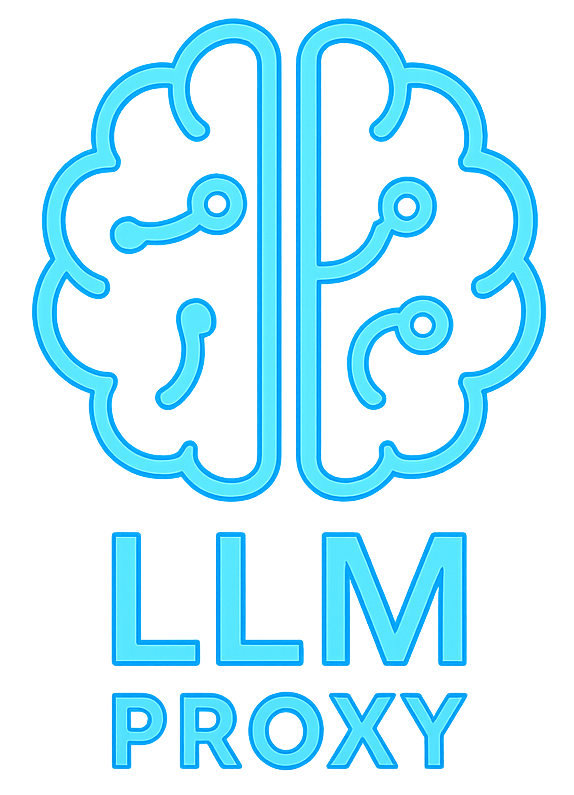

<p align="center">
  
</p>

# LLM API Proxy and Routing Manager

[](https://opensource.org/licenses/MIT)
[](https://dotnet.microsoft.com/download/dotnet/9.0)
[](https://learn.microsoft.com/en-us/dotnet/csharp/)
[](https://www.sqlite.org/)

The LLM API Proxy and Manager is a C#-based ASP.NET Core 9 application designed to serve as an intelligent and resilient intermediary between LLM API clients (e.g., frontend apps, other services) and various OpenAI-compatible backend providers. It centralizes request routing, API key management, error handling, and offers advanced strategies like Model Groups and Mixture of Agents, abstracting backend complexities and ensuring a seamless, uninterrupted, and versatile experience.

## 🚀 Purpose

*   **Aggregate Multiple LLM Backends:** Consolidate access to various OpenAI-compatible APIs (e.g., OpenAI, OpenRouter, Google Gemini, Mistral, DeepSeek, local LM Studio instances).
*   **Dynamic Request Routing:** Intelligently route incoming requests to one or more configured backend providers based on defined strategies for individual models or groups of models.
*   **Advanced Model Orchestration:**
    *   **Model Groups:** Define logical groups of models that can be targeted as a single entity, with their own routing strategies.
    *   **Mixture of Agents (MoA):** Send a user request to multiple "agent" models simultaneously, then use an "orchestrator" model to synthesize a final answer from their collective responses.
*   **Load Balancing & Failover:** Distribute load across multiple API keys for a single backend or across different backends/models within a group. Automatically failover to backup options in case of errors.
*   **Robust Streaming Support:** Full, low-latency pass-through support for `stream=true` (text/event-stream) responses, including for the final output of MoA orchestrators.
*   **Error Abstraction & Resilience:** Suppress transient backend errors (like rate limits or temporary server issues) from reaching the client. Only fails if all configured options for a request are unavailable. Detects application-level errors within successful (200 OK) responses to trigger retries.
*   **Centralized Configuration:** Manage models, model groups, backend providers, API keys, and routing strategies through a simple web-based admin interface.
*   **Observability:** Provides detailed API request/response logging to a local SQLite database for debugging, monitoring, and auditing.

## ✨ Key Features

*   **Model & Model Group Management:**
    *   Define individual **Models** with their own set of backends and routing strategies.
    *   Create **Model Groups** that act as a single endpoint but can contain multiple underlying models.
*   **Supported Routing Strategies:**
    *   **For Models (Backend Selection):**
        *   **Failover:** Prioritize backends/keys in a specific order.
        *   **Round Robin:** Cycle through available backends/keys sequentially.
        *   **Weighted Distribution:** Route traffic to backends according to configured weights.
    *   **For Model Groups (Member Model Selection):**
        *   **Failover:** Prioritize member models in a specific order.
        *   **RoundRobin:** Cycle through available member models sequentially.
        *   **Weighted (Members):** Distribute requests among member models based on assigned weights (currently simplified as random selection if weights are equal).
        *   **Content Based:** Route to a specific member model within the group based on regex matching against the last user message.
        *   **Mixture of Agents (MoA):**
            *   Sends the client's request to multiple configured "agent" models in parallel (non-streaming).
            *   Collects responses from all agents.
            *   Constructs a new prompt (including the original query and all agent responses) and sends it to a designated "orchestrator" model.
            *   The orchestrator's response is then returned to the client (streaming if requested).
*   **Provider Multiplexing:** Seamlessly combine and switch between different LLM providers for models or within groups.
*   **Backend-Specific Model Names:** Map a general model/group name requested by the client to a specific model name required by a particular backend.
*   **Streaming Proxy:** Efficiently proxies `text/event-stream` responses. Failover for streaming requests happens before the first token. For MoA, agent calls are non-streaming, but the final orchestrator response can be streamed.
*   **Intelligent Error Handling:**
    *   Hides transient backend failures from the client.
    *   Detects application-level errors (e.g., context length exceeded) even in 200 OK responses and triggers failover/retry logic for the *next* request to that backend. The current client still receives the error content.
*   **Dynamic Configuration:**
    *   Manage all configurations via a web UI (`/admin`).
    *   Configuration is persisted in `config/dynamic_routing.json`.
    *   Default configurations are loaded on first run.
*   **Standard OpenAI-Compatible Endpoints:**
    *   `POST /v1/chat/completions`
    *   `POST /v1/completions` (Legacy)
    *   `POST /v1/embeddings`
    *   `GET /v1/models` (Lists all configured models and model groups)
*   **Database Logging:**
    *   Detailed logging of requests, backend attempts, responses, and errors to a local SQLite database.
    *   View logs via a paginated and searchable web UI (`/log.html`).
*   **Health Check:** `GET /health` endpoint.

## 🛠️ Technical Stack

*   **Language:** C# 12
*   **Framework:** .NET 9 (ASP.NET Core Minimal API)
*   **Database:** SQLite (with Entity Framework Core) for logging.
*   **Frontend (Admin/Logs):** HTML, Vanilla JavaScript, Bootstrap 5, jQuery (for DataTables).
*   **Key Dependencies:**
    *   `Microsoft.EntityFrameworkCore.Sqlite`
    *   `System.Text.Json`

## ⚙️ Getting Started

### Prerequisites

*   [.NET 9 SDK](https://dotnet.microsoft.com/download/dotnet/9.0) installed.
*   (Optional) Git for cloning the repository.

### Installation & Running

1.  **Clone the repository (if applicable):**
    ```bash
    git clone https://github.com/obirler/LLMProxy.git
    cd LLMProxy 
    ```
    (Or download and extract the source code)
2.  **Restore Dependencies & Build:**
    ```bash
    dotnet restore
    dotnet build
    ```
3.  **Database Migration:**
    The application uses EF Core for database logging. Migrations need to be applied:
    ```bash
    dotnet ef database update
    ```
    This command needs to be run from the project directory where the `.csproj` file is located. If you downloaded a release, the database might be pre-configured or created on first run.
4.  **Configure Port (Optional):**
    The application defaults to port `7548` (HTTP). Change in `Properties/launchSettings.json` (for development) or `appsettings.json` (for Kestrel configuration).
5.  **Run the Application:**
    ```bash
    dotnet run
    ```
    The proxy will start, typically listening on `http://localhost:7548`.

### Initial Configuration (Admin UI)

1.  **Access the Admin UI:** Open `http://localhost:7548/admin`.
2.  **Default Configuration:** On first run or if `config/dynamic_routing.json` is missing/empty, default debug configurations for models and model groups will be loaded.
3.  **Configuring Models:** (See "Model Configurations" section in UI)
    *   Add a **Model Name** (e.g., `gpt-4o-direct`, `phi-3-local`). This is the ID clients use.
    *   Select a **Routing Strategy** for its backends (Failover, Round Robin, Weighted).
    *   Add **Backends:**
        *   **Backend Name:** Descriptive (e.g., `OpenAI-Key1`, `LMStudio-Phi3`).
        *   **Base URL:** LLM provider's API base (e.g., `https://api.openai.com/v1`, `http://localhost:1234/v1`).
        *   **API Keys:** Comma-separated.
        *   **Backend-Specific Model Name (Optional):** If the backend needs a different model ID.
        *   **Weight & Enabled status.**
    *   Save Changes for the model.
4.  **Configuring Model Groups:** (See "Model Group Configurations" section in UI)
    *   Add a **Group Name** (e.g., `MyGeneralPurposeGroup`, `CodingAgents`). This ID is also usable by clients via `/v1/models`.
    *   Select a **Routing Strategy** for the group:
        *   **Failover, Round Robin, Weighted (Members):** Select member models from your defined regular models.
        *   **Content Based:**
            *   Add member models.
            *   Define **Content Rules** (Regex Pattern, Target Model from members, Priority).
            *   Optionally set a **Default Model** from members if no rule matches.
        *   **Mixture of Agents (MoA):**
            *   Select an **Orchestrator Model** from your defined regular models.
            *   Add at least two **Agent Models** (from "Member Models" list, selecting from your regular models). The orchestrator cannot be an agent.
    *   Save Group.
5.  Configuration is saved to `config/dynamic_routing.json`.

## 📖 API Endpoints

### Proxy Endpoints (Client-Facing)

These endpoints mimic the OpenAI API structure.

*   **`POST /v1/chat/completions`**
*   **`POST /v1/completions`** (Legacy)
*   **`POST /v1/embeddings`**
    *   All POST endpoints proxy requests to configured backends based on the `model` field in the request body (which can be a regular model ID or a Model Group ID).
    *   Support `stream=true`.
*   **`GET /v1/models`**
    *   Returns a list of all configured model IDs and model group IDs available through the proxy.
    *   Format: `{"object": "list", "data": [{"id": "model-or-group-id", ...}]}`

### Management Endpoints

*   **`GET /health`**: Basic health check.
*   **`GET /admin`**: Redirects to the Admin UI (`/admin.html`).
*   **`GET /log.html`**: Web UI for viewing API logs from the SQLite database.
*   **Admin API (for UI interaction, default: unsecured):**
    *   `GET /admin/config`: Returns current model configurations.
    *   `POST /admin/config/{modelName}`: Add/Update a model.
    *   `DELETE /admin/config/{modelName}`: Delete a model.
    *   `GET /admin/config/groups`: Returns current model group configurations.
    *   `POST /admin/config/groups/{groupName}`: Add/Update a model group.
    *   `DELETE /admin/config/groups/{groupName}`: Delete a model group.
    *   `GET /admin/logs`: Serves paginated log data for the log viewer.
    *   `GET /admin/logs/{id}`: Retrieves a specific full log entry.

**Security Note:** The `/admin/*` API endpoints and UI are **not secured by default**. In a production environment, these **must** be protected (e.g., via VPN, IP whitelisting, or by adding authentication/authorization middleware to the ASP.NET Core application).

## 🔧 Configuration Details (`dynamic_routing.json`)

The proxy's routing logic is driven by `config/dynamic_routing.json`.

**Example Structure:**

```json
{
  "Models": {
    "gpt-4o-direct": {
      "Strategy": "Failover", // For its backends
      "Backends": [
        {
          "Name": "OpenAI-Primary",
          "BaseUrl": "https://api.openai.com/v1",
          "ApiKeys": ["sk-key1"],
          "BackendModelName": "gpt-4o",
          "Weight": 1,
          "Enabled": true
        }
      ]
    },
    "claude-haiku-agent": { /* ... */ },
    "gemini-pro-agent": { /* ... */ }
  },
  "ModelGroups": {
    "MyCodingMoAGroup": {
      "Strategy": "MixtureOfAgents", // Group strategy
      "Models": ["claude-haiku-agent", "gemini-pro-agent"], // These are Agent Models
      "ContentRules": [], // Not used by MoA
      "DefaultModelForContentBased": null, // Not used by MoA
      "OrchestratorModelName": "gpt-4o-direct" // Must be a defined Model
    },
    "GeneralChatFailover": {
      "Strategy": "Failover", // Group strategy
      "Models": ["gpt-4o-direct", "claude-haiku-agent"], // Member models for failover
      "OrchestratorModelName": null // Not used by Failover
      // ... other fields null or empty if not ContentBased
    }
    // ... more group configurations
  }
}
```

## 💡 Potential Future Enhancements

*   Per-request API key override via headers.
*   More sophisticated weighted load balancing with persistent state.
*   Caching responses for identical non-streaming requests.
*   UI/API for managing static `appsettings.json` values.
*   Built-in authentication/authorization for admin endpoints.
*   Token usage tracking and cost estimation.

## 📄 License

This project is licensed under the MIT License - see the [LICENSE](LICENSE.md) file for details.

## 🙏 Acknowledgements

*   Inspired by various API gateway and proxy concepts.
*   Utilizes the power of ASP.NET Core and .NET.
